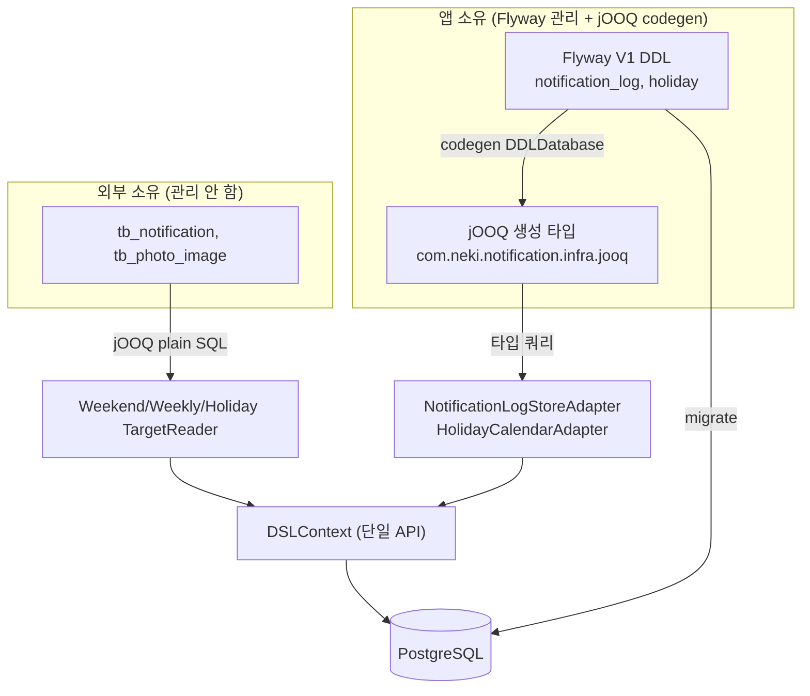

# ADR 0001 — 데이터 접근을 jOOQ + Flyway로 통일 (JPA·JdbcTemplate·QueryDSL 배제)

- 상태: 채택(Accepted)
- 날짜: 2026-06-19
- 관련 PR: #13(codegen 파이프라인) · #14(리더·Holiday 전환) · #15(JPA 제거)

## 맥락

알림 배치 앱은 공유 DB에서 발송 대상을 조회하고 발송 이력을 적재한다. 초기 구현은 데이터 접근이 두 갈래로 나뉘어 있었다.

- **읽기**: 외부 소유 테이블(`tb_notification`, `tb_photo_image`)을 `NamedParameterJdbcTemplate` raw SQL(keyset 페이징)로 조회.
- **쓰기/조회**: 앱 소유 테이블(`notification_log`, `holiday`)을 JPA(Hibernate) 엔티티·Spring Data 리포지토리로 접근.

이 앱은 다음 특성을 가진다.

- **독립 레포** — 기존 사내 레포와 의존성이 엮이지 않는다(팀 표준 JPA+QueryDSL을 반드시 따를 제약이 약함).
- **단순 데이터 접근** — 복잡한 연관관계·애그리거트가 없다. 쓰기는 사실상 `notification_log` insert 1종, 읽기는 단순 select/exists.
- JPA의 핵심 기능(지연 로딩·dirty checking·연관 그래프·cascade)을 **전혀 사용하지 않는다**. ORM 매핑 비용만 부담.

## 결정

데이터 접근을 **jOOQ + Flyway** 한 스택으로 통일하고, **JPA(Hibernate)·`JdbcTemplate`·QueryDSL은 사용하지 않는다.**

- **스키마 소유 = 관리 경계**: 본 앱이 소유하는 테이블(`notification_log`, `holiday`)만 Flyway로 마이그레이션하고 jOOQ codegen 대상으로 삼는다. 외부 소유 테이블은 스키마를 관리하지 않으며 jOOQ **plain SQL**로 조회한다.
- **codegen은 라이브 DB 없이** Flyway V1 DDL에서 `DDLDatabase`로 생성한다(`build/` 하위, 미추적).
- 트랜잭션 매니저는 `DataSourceTransactionManager`(jdbc 스타터). 스키마 SSOT는 Flyway 마이그레이션.

## 근거

- **ORM 미사용** — JPA 이점을 안 쓰므로 Hibernate를 들고 갈 이유가 없다. insert 1종을 위해 ORM 전체를 유지하는 건 비효율.
- **타입 세이프 + 단일 API** — 소유 테이블은 생성 타입으로 컴파일 타임 안전, 외부 테이블은 plain SQL이되 동일 `DSLContext` API로 통일(JdbcTemplate 혼용 제거).
- **소유권 경계 명확화** — 남이 소유한 스키마를 내 레포가 들고 있지 않는다. 외부 스키마 변경은 런타임/E2E로 검출하는 게 책임상 옳다.
- **Flyway는 더 중요해짐** — jOOQ codegen의 타입 소스가 되어, 스키마 SSOT 역할이 강화된다(H-3 결정과 정합).

## 결과

긍정:
- 데이터 접근 스택 단일화(Hibernate 제거). `modules/postgresql` 모듈 삭제로 구조 단순화.
- `notification_log`/`holiday` 접근이 컴파일 타임에 검증됨.
- `SchemaMigrationValidationTest`가 "생성 타입 ↔ Flyway 스키마" 정합을 지킨다(H-3의 jOOQ판).

부정/유의:
- **codegen 빌드 단계 추가** — `generateJooq`(nu.studer.jooq, jOOQ 3.19.22 = Boot BOM 런타임 버전과 일치).
- **외부 테이블은 plain SQL** — 타입 검증이 안 걸린다(외부 소유라 의도된 한계).
- **렌더 케이스 주의** — `DDLDatabase`가 식별자를 대문자로 생성하므로, 런타임은 `RenderNameCase.LOWER`+`RenderQuotedNames.NEVER`로 렌더해야 PostgreSQL 소문자 컬럼과 정합(`JooqConfig`, Spring Boot `DefaultConfigurationCustomizer`로 적용).
- **codegen 범위는 V1 한정** — 후속 마이그레이션이 소유 테이블을 바꾸면 codegen `scripts`에 추가해야 하며, 누락 시 `SchemaMigrationValidationTest`가 실패해 알린다.
- **팀 표준(JPA+QueryDSL) 분기** — 독립 레포라 수용. 본 ADR로 근거를 남긴다.

## 대안

- **읽기 jOOQ / 쓰기 JPA(CQRS식)**: 쓰기에 풍부한 애그리거트가 있을 때 값어치가 있으나, 본 앱은 쓰기가 insert 1종이라 Hibernate를 통째로 유지하는 대가만 큼 → 기각.
- **전부 `JdbcClient`/JdbcTemplate**: codegen 부담은 없으나 타입 세이프를 못 얻고 JdbcTemplate을 피하려는 방향과 어긋남 → 기각.
- **현행 유지(JPA+JDBC 혼용)**: 동작엔 문제없으나 스택 이원화·ORM 미활용 비용 잔존 → 기각.
- **Flyway 제거**: H-3(스키마 소유권) 역행 + Batch 메타 생성 공백 + jOOQ codegen 소스 상실 → 기각.
