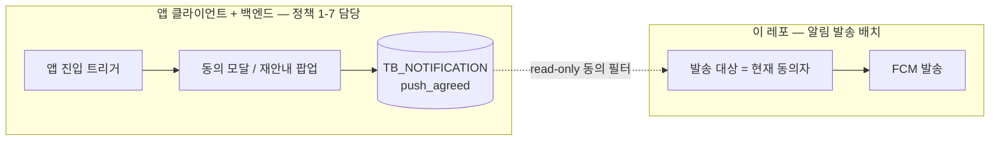

# 네키 알림 스케줄링 배치 — 설계 및 구현 계획

작성일: 2026-06-09
스택: Kotlin + Spring Boot + Spring Batch + PostgreSQL

## 1. 배경 / 목표

네키 앱 사용자에게 **시간 기반 대량 푸시 알림**을 스케줄링으로 발송하는 배치 애플리케이션.
푸시알림 수신 동의 사용자를 디폴트 대상으로 하며, 가능한 경우 개인화 변수를 문구에 적용한다.

## 2. 범위 (Scope)

이 애플리케이션이 책임지는 알림은 **시간 기반 대량 발송 3종**.

| Job | cron 트리거 | 발송 대상 | 변수 |
| --- | --- | --- | --- |
| `WeeklyReminderJob` (아카이빙 1주일 리마인드) | 매일 20:00 | 7일 전 사진 업로드 이력 유저 + 푸시동의 | `[최근 업로드 요일]` (존재 시) |
| `WeekendExploreJob` (주말 전 탐색) | 금/토/일 지정시각 | 전체 대상자 + 푸시동의 | 없음 (기본 문구) |
| `HolidayExploreJob` (연휴/공휴일 탐색) | 매일 깨워 발송일 판정 | 최근 1달 지도사용/업로드 유저 + 푸시동의 | `[공휴일명]` |

### Out of Scope
- 길찾기 후 1시간 아카이빙 유도 알림 (스펙 아웃)
- 브랜드 업데이트 알림 (별도 API 직접 호출로 처리)
- 클릭 이벤트 수집 (클라이언트/별도 시스템 책임). 본 앱은 발송 이력 + 메타데이터만 적재.
- 외부 공휴일 API(특일정보) 연동 — 내부 `holiday` 테이블 수동 시드로 대체.
- **마케팅 알림 수신 동의 획득/재안내 정책 (PRD 1-7)** — 아래 §2-1 참조.

### 2-1. 동의 획득/재안내 정책(PRD 1-7)이 범위 밖인 이유

PRD 1-7(회원가입 시 동의, 미동의·거부 시 7일 후 재안내 팝업, 기존회원 업데이트 후 안내, 미응답 시 다음 진입 재노출 등)은
**동의를 어떻게 획득/재안내하는가**에 대한 정책이며, 다음 두 가지 이유로 본 배치 앱의 책임이 아니다.

1. **트리거가 "앱 진입 시" 실시간 클라이언트 이벤트**다. 본 앱은 cron 기반 시간 트리거 대량 발송 배치라 앱-진입 훅·모달 노출·노출 횟수/미응답/거부-후-7일 타이머 개념이 없다.
2. **산출물이 인앱 모달/팝업 노출**이다. 동의 상태 자체는 앱 클라이언트 + 백엔드가 `TB_NOTIFICATION.push_agreed`에 기록한다.



**본 앱과의 유일한 접점:** 발송 대상을 "현재 푸시 동의자"로 제한하는 **read-only 필터**(§shared-db §2, `TB_NOTIFICATION.push_agreed = true`)뿐이다.
1-7의 거부/미응답/미노출 상태는 모두 *비동의*로 귀결되어 발송 필터에서 동일하게 제외되므로, 발송 관점에서 별도 구분이 필요 없다.

## 3. 핵심 설계 결정

| 항목 | 결정 |
| --- | --- |
| 인스턴스 | 단일 인스턴스 (ShedLock 등 분산 락 불필요) |
| 데이터 읽기 | 공유 PostgreSQL DB **read-only** 조회 (유저/동의/업로드이력/지도사용이력/FCM토큰) |
| 데이터 쓰기 | 동일 공유 DB에 본 앱 전용 테이블(`notification_log`, `holiday`, Spring Batch `batch_*`) 적재 |
| 읽기 접근 기술 | **Jdbc** 기반 projection (`JdbcPagingItemReader` + keyset 페이징). 도메인 엔티티 오염 없음 |
| 쓰기 접근 기술 | **JPA** (`NotificationLog`) — 팀 컨벤션 유지, 도메인 일관성 |
| 발송 경로 | **FCM 직접 호출** (Firebase Admin SDK). iOS 포함 FCM 경유 |
| 중복 발송 방지 | `notification_log` `(user_id, notification_type, business_date)` **unique 제약** |
| 문구 톤 A/B | 발송 시 톤(정보형/친근형/제안형) 배정 후 `notification_log`에 기록 (스펙 1-6 톤별 클릭률 분석용) |
| 커버리지 도구 | **Kover** (Kotlin 네이티브) |

## 4. 모듈 구조

```
application/   ← 부트 jar. Batch Job/Step 조립, @Scheduled, application.yml
   └─ depends on → domain, infra
domain/        ← 순수 Kotlin. 프레임워크 의존 최소
   ├─ model: SendTarget, NotificationType, MessageTone, NotificationLog ...
   ├─ policy: 문구 변수 치환 정책, 톤 배정 정책, 발송 대상 판정/dedup 규칙
   └─ port: SendTargetReader / NotificationSender / NotificationLogRepository 인터페이스
infra/         ← 외부 의존성 어댑터 (depends on → domain)
   ├─ persistence(read):  Jdbc projection ItemReader
   ├─ persistence(write): JPA NotificationLog Repository
   └─ push: Firebase Admin SDK FCM 클라이언트
```

원칙: **domain은 포트(인터페이스)만 정의, infra가 구현(Jdbc/JPA/FCM), application이 와이어링.**

## 5. 공통 Step 파이프라인

세 Job이 동일 골격 공유 (Reader 쿼리·문구만 교체):

```
Reader (Jdbc projection)  → 발송 대상 + 변수원천값 + FCM 토큰 (keyset 페이징)
Processor                 → ① 변수 치환(없으면 기본 문구) ② 푸시동의 최종 재확인
                            ③ 당일 중복 발송 여부 체크 → 스킵
Writer (Composite)        → ① FCM 발송 ② NotificationLog(JPA) 적재
```

## 6. 데이터 모델 (본 앱 소유)

### notification_log
- `id`, `user_id`, `notification_type`, `message_tone`, `variable_applied`(bool), `title`, `body`, `business_date`, `sent_at`, `fcm_result`(SUCCESS/FAILED/SKIPPED)
- UNIQUE `(user_id, notification_type, business_date)`

### holiday
- `id`, `holiday_date`, `name`, `notify_offset_days`(전날=-1/당일=0) 또는 발송일 판정 규칙

## 7. 작업 프로세스 (TDD + 멀티 에이전트 게이트)

관리자(Claude)는 오케스트레이션만 담당. 각 phase는 task 단위로 아래 루프를 반복한다.

```
1. 테스트 작성 agent  → 인수조건 읽고 실패하는 테스트 먼저 작성 (RED)
2. QA agent (게이트)  → 테스트가 인수조건을 충분/정확/비판적으로 검증하는지 판정
                        ❌ 부적절 → 1로 반려  /  ✅ 통과해야만 다음 단계
3. 구현 agent         → 테스트 통과시키는 최소 구현 (GREEN)
4. 검수 agent         → 구현물 정확성·컨벤션·커버리지 리뷰
5. 관리자             → 최종 승인 후 commit (task마다 중간 commit)
```

| 역할 | agent |
| --- | --- |
| 테스트 작성 | general-purpose |
| QA 게이트 | `qa-test-reviewer` (.claude/agents) |
| 구현 | general-purpose |
| 검수 | feature-dev:code-reviewer |

## 8. Phase 분할 + 인수조건

| Phase | Scope | 인수조건 (커버리지 포함) |
| --- | --- | --- |
| **P0. 스캐폴드** | Gradle 멀티모듈, Kotlin+Boot+Batch+JPA+PostgreSQL+Firebase+테스트(JUnit5/MockK/Testcontainers/Kover) 의존성, QA agent 정의 | `./gradlew build` 성공, 컨텍스트 로드 스모크 테스트 통과 |
| **P1. 도메인 코어** | 순수 Kotlin 모델 + 변수치환/톤배정/business_date/dedup 정책 | 정책 단위테스트, **line ≥ 90% / branch ≥ 85%**, 변수 없을 때 기본문구 폴백 검증 |
| **P2. 포트 + 도메인 서비스** | 포트 인터페이스, 프로세서 도메인 서비스(치환→동의재확인→dedup) | fake/mock 단위테스트, 분기(동의X/중복/변수無) 전수, line ≥ 90% |
| **P3. 읽기 어댑터** | Jdbc projection + keyset ItemReader 3종 | Testcontainers PostgreSQL 통합테스트, 쿼리 정확성, line ≥ 80% |
| **P4. 쓰기 어댑터 + FCM** | JPA NotificationLog 저장 + unique 제약, FCM 클라이언트(무효토큰/실패 처리) | dedup 중복 insert 거부 통합테스트, FCM 실패/재시도 단위테스트, line ≥ 80% |
| **P5. 공휴일 지원** | `holiday` 테이블/리포지토리, 발송일 판정 서비스 | 경계일자(D-1/당일/그외) 단위·통합테스트 |
| **P6. 배치 Job 3종** | 공통 Step 조립, 3 Job, skip/retry 정책 | JobLauncherTestUtils + Testcontainers E2E: Job별 read/write/skip 카운트, dedup·동의필터 동작 |
| **P7. 스케줄링/설정** | `@Scheduled` 런처, cron yml, 공휴일 매일-깨움 가드, 최종 문서 | 설정 바인딩 테스트, 스케줄러→Job 기동 검증, 전체 빌드+커버리지 게이트 통과 |

각 phase 내 task마다 RED→QA게이트→GREEN→검수→commit 반복 → phase당 다수의 추적 가능한 commit.

## 9. 커버리지 게이트 정리

| 영역 | 목표 |
| --- | --- |
| 도메인(순수 로직) | line ≥ 90% / branch ≥ 85% |
| infra 어댑터 | line ≥ 80% (Testcontainers 통합 포함) |
| 배치 Job | E2E 시나리오(happy/skip/dedup/동의필터) 커버 |
